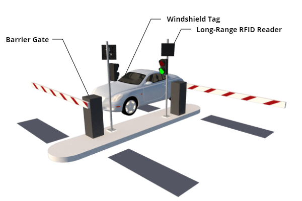
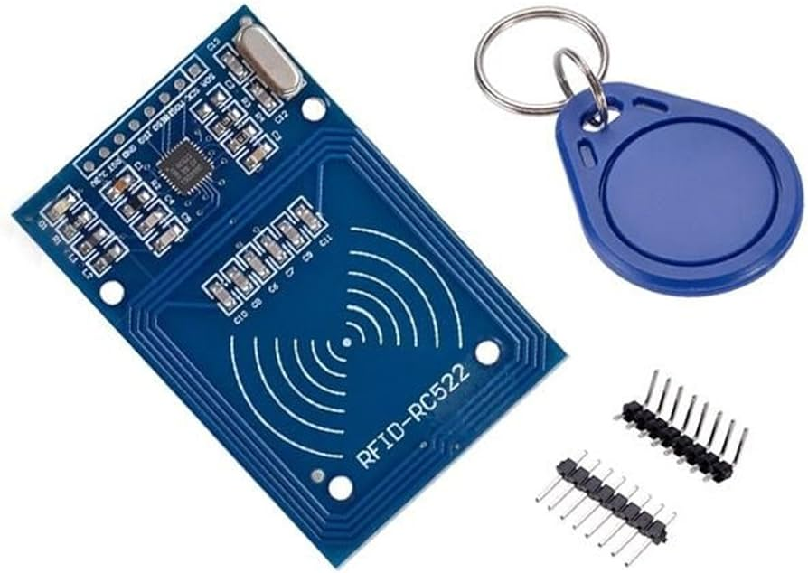
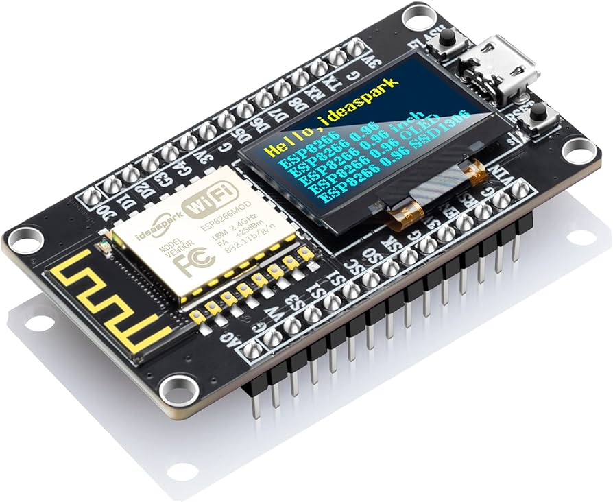

# RFID Powered Smart Parking System

## Overview

This project implements a smart parking mechanism using RFID technology, NodeMCU, MQTT, Node-RED, and MySQL. The system allows for efficient and secure management of parking spaces by verifying authorized vehicles using RFID tags.

## Components

- **NodeMCU (ESP8266):** The NodeMCU is the microcontroller used to interface with RFID sensors, control the servomotor, and communicate via MQTT.

- **MQTT (Message Queuing Telemetry Transport):** MQTT is a lightweight messaging protocol used for communication between the NodeMCU and Node-RED.

- **Node-RED:** Node-RED is a flow-based development tool that enables the integration of different devices and services. It validates and processes information received from the NodeMCU.

- **MySQL Database (Dockerized):** MySQL is used as the database to store information about authorized cars, currently parked cars, and students.

- **Servomotor:** The servomotor controls the gate mechanism, allowing or denying access to authorized vehicles.

- **RFID Sensor and Tag:** RFID technology is used for vehicle identification. The RFID sensor reads the tag attached to the vehicle for authentication.

## System Architecture

## Project Setup

1. **MySQL Docker Container:**

   - Ensure Docker is installed.
   - Run the MySQL Docker container using the provided Dockerfile.

2. **NodeMCU Code:**

   - Flash the NodeMCU with the provided code.
   - Update the MQTT broker details, RFID sensor configuration, and other parameters as needed.

3. **Node-RED Flow:**

   - Import the Node-RED flow provided in the repository.
   - Configure MQTT nodes with the appropriate broker information.

4. **Database Schema:**

   - Set up the MySQL database using the schema provided in the `database_schema.sql` file.

5. **Miscellaneous:**
   - Ensure the images in the `misc` folder (`servo.png`, `rfid.jpg`, `nodemcu.jpg`, `demoUI.jpg`) are accessible for reference.

## Operation

1. **Vehicle Entry:**

   - When an RFID tag is detected, the NodeMCU publishes entry information via MQTT.
   - Node-RED validates the entry, checking if the vehicle is authorized and currently not parked.
   - If authorized, the servomotor opens the gate for 5 seconds, and the entry is recorded in the database.

2. **Vehicle Exit:**

   - Upon exit, a similar process occurs.
   - Node-RED validates the exit, updates the database, and controls the servomotor to allow the vehicle to leave.

3. **Status Indicators:**
   - A red light indicates an unauthorized vehicle, while a green light indicates an authorized one.

## Demonstration

## Images for Reference

- 
- 
- 
- 

Feel free to reach out for any further clarification or assistance!
